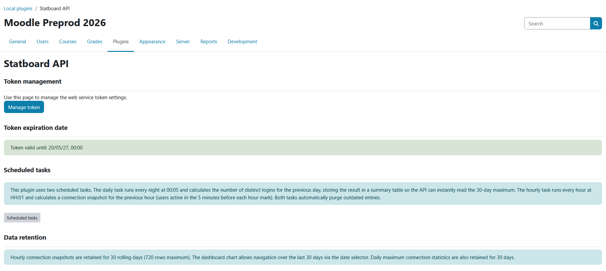
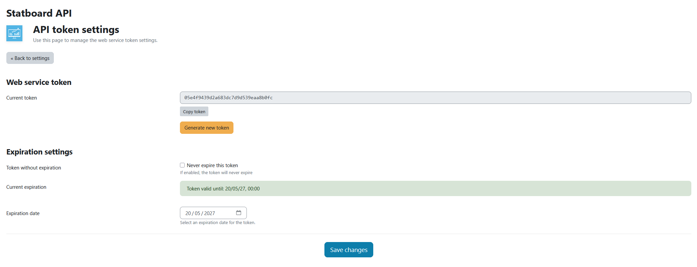

<p align="center">
  
</p>

# Statboard API

A Moodle local plugin that exposes platform usage statistics through a single, secure REST web service — designed to feed an external dashboard with key metrics such as active users, course counts, real-time online presence, daily login peaks, hourly connection histograms and quiz completions.

Built for use on multi-server, high-volume Moodle installations.

## Highlights

- **Single REST endpoint** returning a complete metric set in one call.
- **Optimised for scale**: combines MUC cache (with per-metric TTL) and pre-aggregated summary tables fed by cron, keeping query count low even on logstores with hundreds of millions of rows.
- **Multi-database**: works on PostgreSQL 12+, MySQL 5.7.33+ and MariaDB 10.6+ (portable SQL with named parameters, no `UNIX_TIMESTAMP()`).
- **Secure**: bearer token authentication, dedicated webservice user, fine-grained capabilities, full Privacy API implementation.
- **Cluster-friendly**: scheduled tasks marked `blocking=1` to prevent simultaneous execution across nodes.
- **Localised** in 7 languages: English, French, German, Spanish, Italian, Portuguese (Portugal) and Portuguese (Brazil).

## Requirements

- Moodle 4.1 or later (`2022112800+`).
- PHP 8.0 or later.
- One of: PostgreSQL 12+, MySQL 5.7.33+, MariaDB 10.6+.
- Web services and the REST protocol must be enabled at the site level after installation.

## Installation

### From the Moodle Plugins Directory

1. Go to *Site administration > Plugins > Install plugins*.
2. Search for "Statboard API" or upload the ZIP file.
3. Follow the installation wizard.

### Manual installation

1. Copy the plugin folder to `local/su_statboard_api` in your Moodle installation.
2. Visit *Site administration > Notifications* — Moodle will detect the plugin and run the installer.
3. The installer automatically creates a dedicated webservice user, the external service, links the API function and generates a permanent token.

### Post-install configuration

After installation:

1. Enable web services globally: *Site administration > Advanced features > Enable web services*.
2. Enable the REST protocol: *Site administration > Server > Web services > Manage protocols*.
3. Retrieve your API token from *Site administration > Plugins > Local plugins > Statboard API*.

## Screenshots

### Plugin landing page

Reached from *Site administration > Plugins > Local plugins > Statboard API*. The page shows the current token expiration date at a glance, a link to open the token management screen, and reference information on the scheduled tasks and the data retention policy applied to the aggregated statistics tables.



### Token settings page

Reached via the **Manage token** button on the landing page. From here you can view the current API token, copy it to the clipboard, regenerate a new one, and configure the expiration policy (fixed date or never-expire). All form submissions are protected by `sesskey()` and require the `local/su_statboard_api:managetokensettings` capability.



## What gets installed

The installer (`db/install.php`) creates the following items in your Moodle database. All of them are removed cleanly by the uninstaller (`db/uninstall.php`).

**Two custom tables** (declared in `db/install.xml`):

- `local_su_statboard_api_day` — daily aggregated login counts, max 30 rows (rolling 30-day retention). **Contains only aggregated counters, no personal data.**
- `local_su_statboard_api_hour` — hourly snapshots of active users, max 720 rows (24 × 30). **Contains only aggregated counters, no personal data.**

**One dedicated webservice user**:

- Username pattern `webservice_statboard_<timestamp>` — random password, assigned the `manager` role at the system level. Used exclusively as the identity behind the REST token.

**One web service and one function**:

- Service: `SU Statboard API Service` (shortname `local_su_statboard_api`)
- Function: `local_su_statboard_api_get_statboard_stats`
- One permanent token automatically generated and stored in the plugin configuration.

**Two capabilities** (declared in `db/access.php`):

- `local/su_statboard_api:view` — required to call the API.
- `local/su_statboard_api:managetokensettings` — required to access the token management page.

**Plugin configuration entries** (in `config_plugins`):

- `webservice_token`, `token_validity_period` (default `365`), `token_no_expiration` (default `'1'`).

**Two scheduled tasks** (declared in `db/tasks.php`):

- `\local_su_statboard_api\task\aggregate_daily_stats` — runs nightly at 00:05.
- `\local_su_statboard_api\task\aggregate_hourly_stats` — runs hourly at HH:01.

Both tasks are declared `blocking=1` to prevent concurrent execution on clustered installations.

## Usage

### Calling the API

```bash
curl -X POST "https://moodle.example.com/webservice/rest/server.php" \
  -d "wstoken=YOUR_TOKEN" \
  -d "wsfunction=local_su_statboard_api_get_statboard_stats" \
  -d "moodlewsrestformat=json" \
  -d "date=0"
```

The `date` parameter is a Unix timestamp; pass `0` for today.

### Response format

```json
{
    "total_users": 1250,
    "total_courses": 89,
    "users_online_now": 42,
    "max_connections": {
        "count": 456,
        "date": "2025-01-15"
    },
    "hourly_connections": [
        { "hour": "00:00", "count": 5 },
        { "hour": "08:00", "count": 45 }
    ],
    "quiz_completed_today": 312
}
```

### Metric definitions

| Field | Meaning |
|-------|---------|
| `total_users` | Active users (not deleted, not suspended) |
| `total_courses` | Number of courses excluding the front page (`id > 1`) |
| `users_online_now` | Real users active in the last 5 minutes (excludes `webservice` and `nologin` accounts). Always live, never cached. |
| `max_connections` | Daily login peak over the last 30 days, with date |
| `hourly_connections` | Hourly snapshot of distinct active users for the requested day |
| `quiz_completed_today` | Number of quiz attempts in `finished` state for the requested day |

## Architecture

### Cache strategy

| Metric | TTL | Why |
|--------|-----|-----|
| `total_users`, `total_courses` | 1 h | Very stable |
| `max_connections` (today's count) | 15 min | Slow to change during the day |
| `quiz_completed_today` | 5 min | Updates regularly |
| `users_online_now` | none | Must stay real-time |
| `hourly_connections` | none | Read from the pre-aggregated `local_su_statboard_api_hour` table (≤ 24 rows per call — already fast, no cache needed) |

Cache keys for date-scoped metrics include the day (`max_today_YYYY-MM-DD`, `quiz_completed_YYYY-MM-DD`) so they reset automatically at midnight.

### Scheduled tasks

The plugin avoids scanning the `logstore_standard_log` on every API call by maintaining two summary tables fed by cron.

- `\local_su_statboard_api\task\aggregate_daily_stats` — runs nightly at 00:05, computes distinct logins for J-1, persists into `local_su_statboard_api_day`, prunes entries older than 30 days.
- `\local_su_statboard_api\task\aggregate_hourly_stats` — runs hourly at HH:01, takes a 5-minute snapshot for the previous hour boundary, persists into `local_su_statboard_api_hour`, prunes entries older than 30 days.

Both tasks are declared `blocking=1` to prevent simultaneous execution across cluster nodes.

## Privacy and data handling

This plugin handles personal data minimally:

- **Web service tokens** linked to a Moodle user are stored in the standard `external_tokens` table. These are declared in the Privacy API and exported/deleted on GDPR request.
- **Aggregated statistics tables** (`local_su_statboard_api_day`, `local_su_statboard_api_hour`) store only counters (number of distinct users, login counts) without any `userid` or other identifier. They are **not** declared in the Privacy API because they contain no personal data.
- **Event logging**: each API call triggers a `stats_viewed` event into Moodle's standard logstore, attributed to the user identified by the token. Subject to standard Moodle log retention policies.

See `classes/privacy/provider.php` for the full Privacy API declaration.

## Security

- Token-based authentication via Moodle's web services framework.
- Dedicated webservice user (`webservice_statboard_*`) created at install time.
- Two capabilities: `local/su_statboard_api:view` (read) and `local/su_statboard_api:managetokensettings` (token management).
- All form submissions protected by `sesskey()`; all parameters validated through `optional_param()` / `required_param()`.
- Full Privacy API implementation (`classes/privacy/provider.php`) covering metadata declaration, user data export and deletion.

## Development

### Project structure

See [DEVELOPERS_en.md](DEVELOPERS_en.md) (English) or [DEVELOPERS_fr.md](DEVELOPERS_fr.md) (French) for the complete technical documentation (architecture, tables, classes, helpers, troubleshooting).

### Running scheduled tasks manually

```bash
php admin/cli/scheduled_task.php --execute='\local_su_statboard_api\task\aggregate_daily_stats'
php admin/cli/scheduled_task.php --execute='\local_su_statboard_api\task\aggregate_hourly_stats'
```

### Reporting issues

Please report bugs and feature requests at:

https://github.com/dev-capsule/moodle-local_su_statboard_api/issues

## Roadmap

### Coming soon: companion mobile app

A native mobile application is in the works to consume the Statboard API and display the metrics on the go: live online users, daily login peaks, hourly connection curves and quiz completions — directly from your phone.

The plugin REST endpoint already exposes everything the app needs in a single call, so no further server-side change will be required when the mobile app is released.

## License

This plugin is distributed 